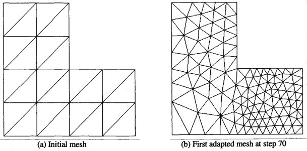
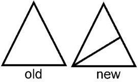
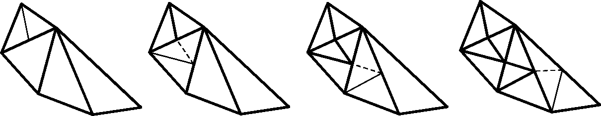

# 🔹 Mesh Refinement Project

## Overview

This project focuses on the **complex refinement** of a triangular mesh.  
Given an initial triangulated domain, the goal is to refine selected triangles to obtain a **finer and conforming mesh**, improving geometric resolution while preserving mesh quality.

  

---

## 🧩 Algorithm Description

The refinement process is based on the **Longest Edge Bisection (LEB)** method.  
For each triangle \( T \), the algorithm identifies its **longest edge** \( e^T \), computes the **midpoint** \( M_{e^T} \), and connects it to the **vertex opposite** to \( e^T \), creating two new sub-triangles \( T_1 \) and \( T_2 \).

However, after refinement, the resulting mesh must remain **conforming**, meaning that adjacent triangles must share either a **full edge** or a **single vertex** — never a partial edge.

  

---

## ⚙️ Complex Refinement

To ensure conformity and preserve mesh quality, the **complex refinement** procedure is applied.  
When a triangle \( T \) is refined, its **neighbor triangle \( S \)** that shares the refined edge must also be updated to avoid inconsistencies.  

Instead of performing a simple subdivision, the **complex method** recursively applies the **longest edge bisection** to the adjacent triangles as well.  
This process continues until all triangles satisfy the **conformity condition**, ensuring that:

- The mesh remains **consistent** across adjacent elements;  
- The **quality** of the original mesh is preserved;  
- The **transition** between refined and unrefined regions is smooth and geometrically accurate.

  

The folder **`presentation_and_report/`** contains:
- A detailed explanation of the **complex refinement methodology**  
- **Experimental analyses** and performance evaluation  
- **Results and visualizations** of the refined meshes  

---

## 🧠 Key Concepts

- **Longest Edge Bisection (LEB):** ensures systematic and repeatable refinement.  
- **Complex Refinement:** maintains conformity across adjacent triangles through recursive subdivision.  
- **Mesh Quality Preservation:** prevents the creation of irregular or poorly shaped elements.  

The project was done in collaboration with Giorgio Musso and Matteo Racca.
